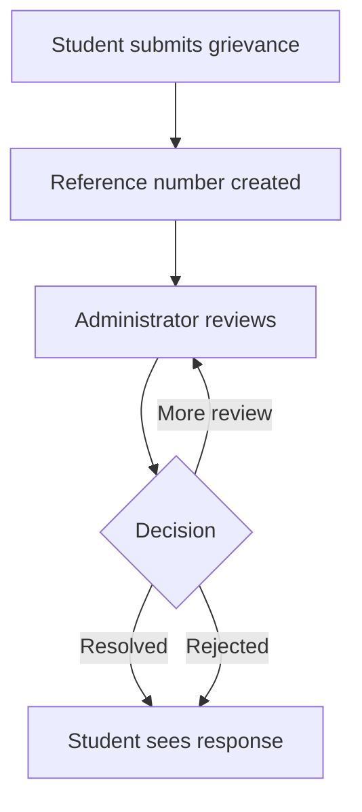

# Student Grievance Redressal System (SGRS)

A responsive, role-based web application that helps students submit grievances, track progress and receive documented responses from administrators.

This academic project demonstrates practical Python web development, relational database design, authentication, authorization and user-focused interface design.

## Features

### Student portal

- Secure account registration and sign-in
- Grievance submission with category and priority
- Unique reference number for every submission
- Personal dashboard with status summaries
- Full progress timeline and administrator responses

### Administrator portal

- Central grievance queue
- Search by reference, title, student name or student ID
- Filter by status and category
- Update status and provide a documented response
- Export filtered grievance records as CSV
- Complete activity history for accountability

### Engineering and security

- Role-based access control for students and administrators
- Password hashing with Werkzeug
- CSRF protection for state-changing forms
- Parameterized SQLite queries
- Secure response headers
- Input validation and request-size limits
- Automated tests and GitHub Actions workflow

## Technology Stack

- **Backend:** Python 3.10+, Flask
- **Database:** SQLite
- **Frontend:** HTML5, CSS3, Jinja templates
- **Testing:** pytest
- **Automation:** GitHub Actions

## Project Structure

```text
student-grievance-redressal-system/
├── .github/workflows/tests.yml
├── instance/
├── static/style.css
├── templates/
├── tests/
├── app.py
├── database.py
├── schema.sql
├── requirements.txt
└── README.md
```

## Run Locally

1. Clone the repository and open the project folder:

   ```bash
   git clone https://github.com/nadawitarig/student-grievance-redressal-system.git
   cd student-grievance-redressal-system
   ```

2. Create and activate a virtual environment:

   ```bash
   python -m venv .venv
   ```

   macOS/Linux:

   ```bash
   source .venv/bin/activate
   ```

   Windows:

   ```powershell
   .venv\Scripts\activate
   ```

3. Install the dependencies:

   ```bash
   pip install -r requirements.txt
   ```

4. Copy `.env.example` to `.env` and replace the sample secret key:

   ```bash
   cp .env.example .env
   ```

   On Windows, create a file named `.env` and copy the values from `.env.example`.

5. Create an administrator account:

   ```bash
   flask --app app create-admin
   ```

6. Start the application:

   ```bash
   flask --app app run --debug
   ```

7. Open `http://127.0.0.1:5000` in your browser. Students can register directly from the home page.

## Run Tests

```bash
pip install -r requirements-dev.txt
pytest
```

## Application Workflow



## Future Improvements

- Email notifications for status changes
- File attachments with type and malware validation
- Department-level assignment and escalation
- Resolution-time analytics dashboard
- Anonymous reporting with institution-specific policy controls
- PostgreSQL support for production deployment

## Academic Purpose

SGRS was created as an academic portfolio project. It is a functional prototype and should receive an institution-specific security, privacy and deployment review before handling real student records.

## Author

**Nadawi Tarig Abdelghani Elsadig**  
Electronics & Communication Engineering Student at KL University

- [GitHub](https://github.com/nadawitarig)
- [LinkedIn](https://www.linkedin.com/in/nadawitarig)

## License

This project is available under the [MIT License](LICENSE).
